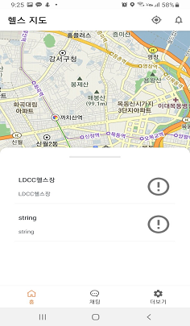
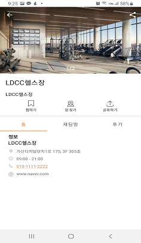

👀 gym-for-u
=================

GFY는 내 주변에 헬스장을 보여주고 같이 운동을 할 파트너를 구하는 목표로 개발을 진행하고 있습니다. 

피드백은 언제나 환영합니다.✨

🙌소개
------------
사용된 구조
* Android Clean Architecture
  * presentation : 프레젠테이션 계층은 UI와 관련된 코드를 캡슐화, 모든 UI와 관련된 컴포넌트 또는 안드로이드 프레임워크와 관련된 코드들을 이 계층에서 다룸
  * domain       : domain 모듈은 비즈니스 로직들을 한 계층에서 관리하는데 초점을 맞춘다. 이를 통해 코드를 깨끗하게 관리하기 용이
  * data         : 데이터 입출력 코드를 하나의 계층에서 관리

사용된 라이브러리
* Android Jetpack : 훌륭한 Android 앱을 만들기 위한 구성요소, 도구 라이브러리 입니다.
  * Foundation : 핵심 시스템 기능, Kotlin 확장 및 multdex 및 자동 테스트 지원을 위한 구성요소입니다.
  * Architecture : 강력하고 테스트가능하며 유지 관리 가능한 앱을 설계하는데 필요한 라이브러리 모음입니다.
    * DataBinding : 관찰 가능한 데이터를 UI요소에 바인딩합니다.
    * Lifecycles : 수명 주기 이벤트에 자동으로 응답하는 UI를 만듭니다.
    * LiveData : 수명주기를 고려한 관찰가능한 데이터 개체를 빌드합니다.
    * Navigation : 앱 안의 여러가지 탐색을 구현하도록 도와줍니다.
    * ViewModel : 앱 회전 시 소멸되지 않는 UI 관련 데이터를 저장 합니다. 
  * UI : 앱에서 UI구성요소
    * Layout : 다양한 위젯을 배치합니다.
    * Fragment : 구성 가능한 UI 기본 단위입니다.
* Coroutine : 비동기 작업들의 코드를 간소화하고 메모리 릭을 줄이기 위해 사용합니다. 
* Dagger hilt : 의존성 주입 라이브러리
* Glide : 이미지 로딩 라이브러리

🤷‍♀️시작하기
------------
이 프로젝트는 Gradle Build 시스템을 사용합니다. 프로젝트를 빌드하려면 Android Studio에서 "Import Project"를 사용하세요.

👍스크린샷
-----------

